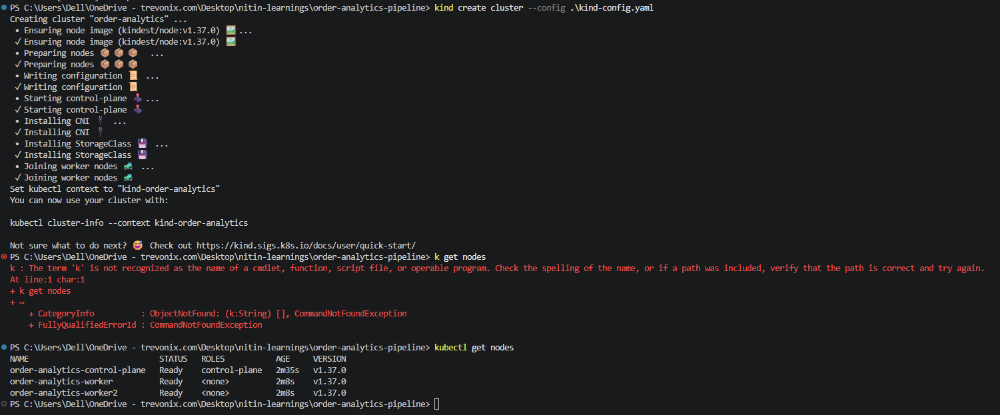
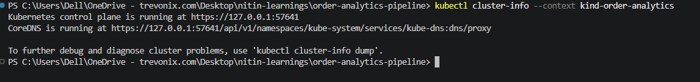
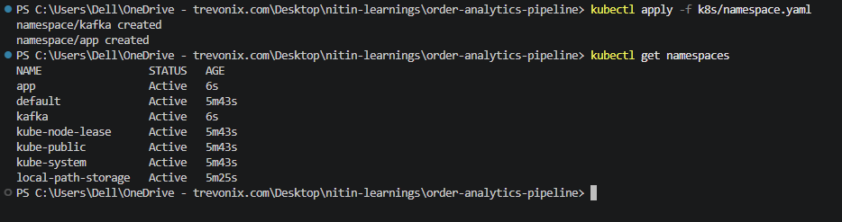

# order-analytics-pipeline
- Producer, consumer, dashboard, Postgres, Kafka topics — the actual business logic. 
- This is the thing with a story: "simulates orders, aggregates revenue, flags fraud."

# Issues Tracker list
[1] - Setup cluster with nodes using kind-config -> Install kind.
       `winget install Kubernetes.kind`
       and then, 
      

      

      
[2] -
[3] -
[4] -
[5] - 
[6] -
[7] -
[8] - 
[9] -
[10]-k ge